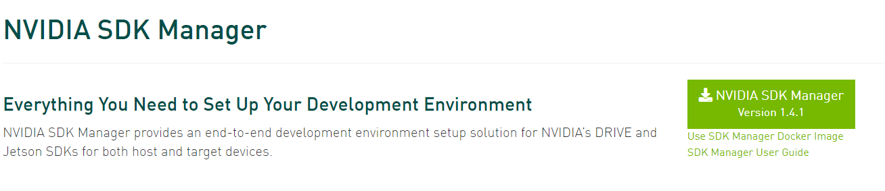
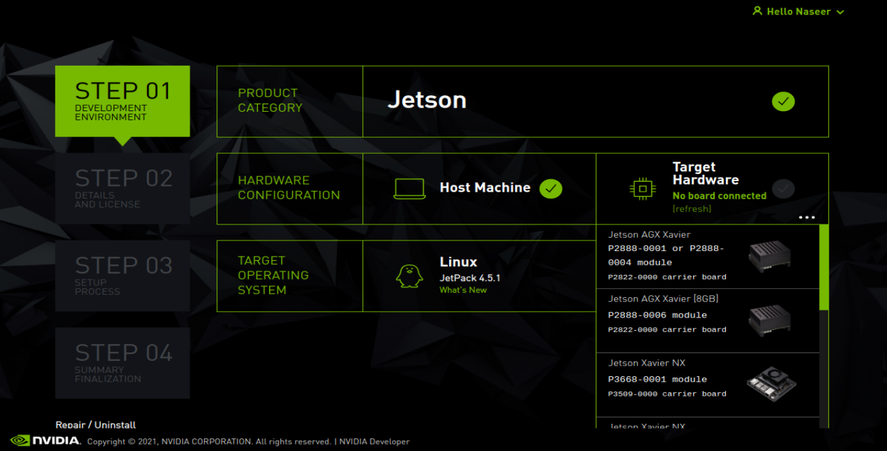
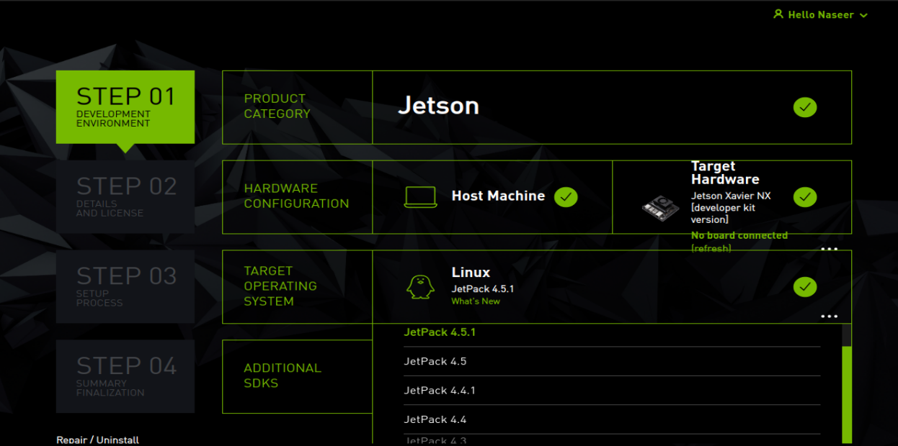
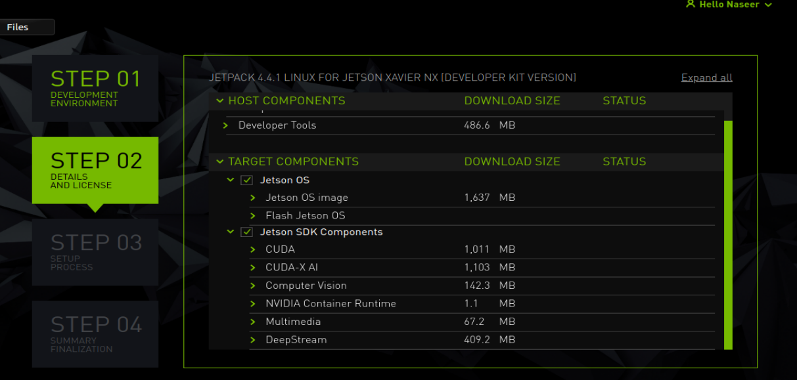
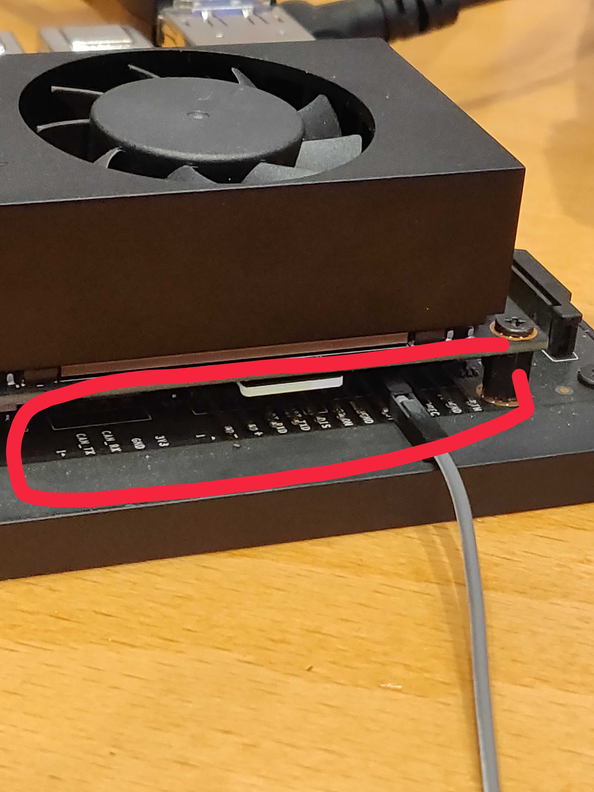
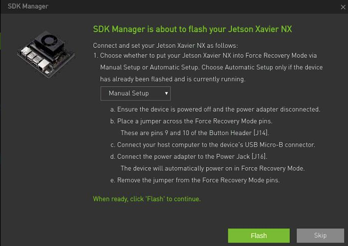

# Flashing Jetson setup

Here are some [official instructions](https://docs.nvidia.com/sdk-manager/install-with-sdkm-jetson/index.html).

1. Download and install Nvidia SDK Manager: [https://developer.nvidia.com/nvidia-sdk-manager](https://developer.nvidia.com/nvidia-sdk-manager)

    

2. After installing SDK open SDK Manager from Search

3. Login as a

4. On `Target Hardware`, select the device you want to flash.

    

5. Now change the jetpack version from `Target Operating System` to 4.4.1

    

6. Press continue.

    

7. On `step 03`, select Manual Setup. Outside in real world, connect Jetson with SDKs PC using USB cable, and power on the Jetson. Just follow the instruction too.

   Put jetson in Force Recovery Mode.
   For carrier board revision A02, these are pins 3 and 4 of J40, which is located near the camera header.

   1. To do this, power off the jetson and disconnect power
   2. connect the jumper pins to Force Recovery Mode
        

    

8.  After clicking flash, the Jetson begin to initiated OS installation,

9.  Put username and password in SDK's PC.

10. In `step 04` just click Finish.
